# calebhamsa.fun

Caleb's blocky corner of the internet: 🎵 **Note Blocks** (notes, chords,
scales and an ear-training game), 🎨 **Draw**, ✍️ **Write** (print and
cursive tracing), and ⛏️ **Build** (a block world with water, steam,
electricity and gears: see [the Build page blocks](#-the-build-page-blocks)).

It's built with plain HTML, CSS and JavaScript (no frameworks, no build
step), so every file can be opened, read, changed and tried.

## Run it on your computer

The pages use JavaScript "modules", which browsers only load from a web
server (not by double-clicking the file). Python has a tiny one built in:

```bash
cd caleb-website
python3 -m http.server 8000
```

Then open <http://localhost:8000>. Change a file, save, and reload the page.

## What's where

| File | What it does |
|---|---|
| `index.html` | The homepage: title, five big blocks, favorite things |
| `music.html` | The Note Blocks page layout |
| `draw.html` | The Draw & Trace page layout |
| `build.html` | The Build page layout |
| `chem.html` | The Chemistry room layout |
| `css/blocks.css` | How everything **looks**: colors, block buttons, animations |
| `js/music-theory.js` | The music brain: notes as numbers, chords, scales (pure math) |
| `js/music.js` | Makes Note Blocks work: sound, modes, record, Guess it! |
| `js/sound.js` | The shared sound machine: voices and playing notes |
| `js/build.js` | Makes the Build page work: tools, palette, clock, saving |
| `js/world.js` | The block world: a grid of block names (pure) |
| `js/blocks/basic.js` | ⛏️ Basic blocks: falling sand, singing note blocks |
| `js/blocks/electric.js` | ⚡ Power blocks: batteries, wires, switches, lamps, buzzers, clickers |
| `js/circuit.js` | The electricity math: loops, brightness, short circuits (pure) |
| `js/blocks/water.js` | 💧 Water blocks: pipes, valves, faucets, drains, burners, chillers, turbines, pumps |
| `js/fluids.js` | How water and steam move: falling, spreading, squishing (pure) |
| `js/blocks/gears.js` | ⚙️ Gear blocks: gears, axle, crank, water wheel, motor, generator |
| `js/spin.js` | How turning passes from gear to gear, and when gears jam (pure) |
| `js/blocks/registry.js` | The list of block packs (add new packs here) |
| `js/block-art.js` | Draws blocks pixel-art style |
| `js/saves.js` | Keeps the three Build worlds saved |
| `js/chem/room.js` | Makes the Chemistry room work: tools, atoms, name cards, the book |
| `js/chem/board.js` | The chemistry board: atoms holding hands, finished and stuck molecules (pure) |
| `js/chem/smiles.js` | Reads molecules written as SMILES text, like `CCO` (pure) |
| `js/chem/canon.js` | Gives each molecule one label, however it was built (pure) |
| `js/chem/book.js` | The collection book and the unlock ladder (pure) |
| `js/chem/lookup.js` | "What did I make?": hand-written list, then the big list |
| `js/chem/kid-names.js` | The hand-written molecules: kid names and fun facts |
| `js/chem/chem-art.js` | Draws atoms, sticks and hands |
| `js/chem/save.js` | Keeps the chemistry board and book saved |
| `data/molecules.json` | 69,000 real molecule names from PubChem (made by `tools/chem-db/`) |
| `js/draw.js` | The drawing pad: brushes, colors, clear, save |
| `js/trace.js` | Handwriting sheets: lines, print/cursive letters, fade-out rows |
| `js/ui.js` | Little helpers every page shares (buttons, grid swipes, picture names) |
| `js/pwa.js` | Starts the offline helper |
| `sw.js` | The offline helper ("service worker"): saves the site so it works with no internet |
| `manifest.webmanifest` | The app's name, icons and colors, for "Add to Home Screen" |
| `img/icon-pixels.txt` | **The app icon, drawn with letters**: one letter per pixel |
| `tools/make-icons.js` | Turns `icon-pixels.txt` into every icon file (no libraries needed) |
| `img/share-card.html` | The picture shown when someone shares a link to the site |
| `tools/make-share-card.cjs` | Takes a screenshot of the share card (needs Playwright, see below) |
| `tests/` | Automatic checks: run `npm test` (needs Node 20+, nothing to install) |

Every file starts with a comment explaining what it does, and every
function has a comment saying what goes in and what comes out.

## 🧱 The Build page blocks

The Build page has three tools at the bottom:

- **🧱 BUILD**: tap (or drag) to put the chosen block down.
- **⛏️ DIG**: tap (or drag) to take blocks away. It scoops up water too.
- **✋ USE**: tap a block to make it do its thing: a switch flips, a valve
  opens, a note block sings.

The blocks are on five tabs. Here's what every one of them is. The same
explanations are in the game too: tap **❓** for the guide, or press and hold
a block in the palette to read about just that block. (The guide's words live
with the blocks, in each pack's `guide` in `js/blocks/*.js`.)

### ⛏️ BLOCKS

| | Block | What it does |
|---|---|---|
|  | **Grass** | A plain building block, dirt with grass on top. |
|  | **Dirt** | A plain building block. |
|  | **Stone** | A plain building block. Holds water, so it's good for tanks. |
|  | **Wood** | A plain building block. Electricity can't go through it. |
| 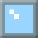 | **Glass** | See-through. Build a glass tank to watch the water inside. |
|  | **Obsidian** | A plain dark building block. |
|  | **Gold** | A building block that **carries electricity**, like real gold. It can be used as wire. |
|  | **Sand** | **Falls** until it lands on something. It sinks through water (the water floats up and swaps places). |

**Note blocks:**
      

Each one sings its note when you tap it with ✋ USE. They're the same colors as
the Note Blocks page. Put one in an electric loop and it sings by itself when
the electricity starts flowing.

### 💧 WATER

Water and steam are real **amounts**: a cell can be full, half full, or
nearly empty, and water never appears or disappears by itself.

| | Block | What it does | ✋ USE |
|---|---|---|---|
|  | **Water** | Not really a block: BUILD **pours** a cell full of water. It falls, spreads out and levels off. Deep water gets squished, so it pushes **up** through pipes and U-tubes. | — |
|  | **Steam** | Pours a cell full of steam. Steam is water's opposite: it **rises** and spreads out under ceilings. | — |
|  | **Pipe** | Carries water and steam. Pipes join up with the pipes next to them. The sides are sealed, and the **end** of a pipe is open, so water pours out of it. | — |
|  | **Valve** | A pipe with a tap in it. Green = open, red = shut.  | open ↔ shut |
|  | **Faucet** | Drips water out of its bottom, forever. | — |
| 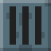 | **Drain** | Water that flows into it disappears. | — |
|  | **Burner** | Boils the water just above it into steam. Off, it looks like this:  | on ↔ off |
|  | **Chiller** | Very cold: steam touching it turns back into water (it "rains"). | — |
|  | **Turbine** | A fan inside a pipe. Steam rushing through it spins it, and that makes **electricity**: wire it up like a battery. More steam = more power. | — |
|  | **Pump** | Uses **electricity** to push water the way its arrow points, even uphill. Wire it into a loop with a battery (wires on the sides the pipe isn't on). The arrow glows when it has power.  | turns: → ↓ ← ↑ |

### ⚡ POWER

Electricity only flows around a complete **loop**: out of the battery's
**+** end, along wires and through things, and back into its other end.
While it flows, little yellow **dots** run along the wires, so you can see it go.

| | Block | What it does | ✋ USE |
|---|---|---|---|
|  | **Battery** | Pushes electricity out of its **+** end. The + is on top (or on the right, when wires come from the sides). Two batteries in a row push twice as hard. | — |
|  | **Wire** | Carries electricity. It joins every wire, gold block and part next to it. | — |
|  | **Switch** | A gap in the loop that you can close. Open (tipped up) = no electricity. Closed (flat) = it flows. 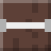 | open ↔ closed |
|  | **Lamp** | Lights up when electricity flows through it: brighter with more. Lit:  | — |
|  | **Buzzer** | Hums while electricity flows through it: louder with more. | — |
|  | **Clicker** | A switch that flips itself: on for one second, off for one second. Put note blocks in its loop for music. | — |

**Parts turn to face their wires.** A lamp, switch, buzzer or battery with
wires on its left and right connects sideways; with wires above and below, it
connects up and down. The little gray metal ends show which way it's facing.
Wires count first: three or more lamps packed side by side between a wire
above and a wire below all face the wires, and all light.

**Short circuit!** If a battery's + end is wired straight back to its other
end with nothing in between, it **sparks and smokes** (). Real
batteries get dangerously hot when you do that, so never try it with a real
one. Nothing breaks here: fix the wiring and it stops.

### ⚙️ GEARS

Spinning things pass their turning on to whatever they touch. **Gears**
that touch turn **opposite** ways. Things on the same **shaft** (an axle,
or a crank, wheel, motor or generator touching a gear) turn the **same** way.

| | Block | What it does | ✋ USE |
|---|---|---|---|
|  | **Small gear** | 8 teeth. Turns the gears next to it the other way. | — |
|  | **Big gear** | 16 teeth, so it turns **half as fast** as a small gear it's touching (and a small gear driven by it turns **twice as fast**). Big gears also touch corner to corner. | — |
|  | **Axle** | A rod: carries turning in a straight line, the same way round. | — |
| 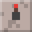 | **Crank** | Hand power! Red knob = stopped, green knob = turning. 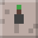 | stop → ↻ → ↺ → stop |
|  | **Water wheel** | Turns when 💧 water flows through it. More water = faster. | — |
|  | **Motor** | Turns ⚡ electricity into turning. Put it in a loop with a battery (wires on its sides). Move the battery to the other side of the loop and it turns the other way. | — |
|  | **Generator** | Turns turning into ⚡ electricity: wire it up like a battery. Its **+** end swaps when it turns the other way. | — |

**Jammed!** Three big gears all touching each other (in an L) can't turn: each
one would have to turn both ways at once. The whole group stops and shows a
red ❌ (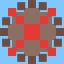).

**Speed and strength.** Everything that turns gears has a **top speed** (how
fast it goes with nothing to push) and a **strength** (how hard it can push
before it stops). The harder it has to push, the slower it goes, like a real
motor or a real arm. A crank has strength 2. A water wheel gets stronger the
more water hits it (one faucet's worth = as strong as a crank). A motor gets
stronger with more electricity. Two of them on the same gears **add up**. Two
cranks turning opposite ways push against each other: the stronger one wins.

**Gears change speed, not power.** A small gear driven by a big one spins
twice as fast but pushes half as hard. Gearing a generator up makes it spin
faster, but it gets harder to turn, so the crank slows down: you never get out
more than you put in.

**Generators push back.** Making electricity takes work. The more lamps a
generator lights, the harder it is to turn. With nothing wired to it, it spins
freely. Join its two ends with plain wire (a short circuit) and it gets very
hard to turn, because a big current flows: watch the dots race. Take the wire
away and it's easy again. Turn it slowly and it still makes a little
electricity: a dim lamp, not a dark one.

**Nothing runs forever.** A generator turns at most 8 tenths of the work you
put in into electricity (the rest becomes heat, like in a real one), so a motor
powered by a generator on its own gears slows down and stops. (The same goes
for a pump pushing water through a water wheel that turns the pump's own
generator.)

### 🏗️ LIFTING

A **winch** winds rope in to lift things, and turning it takes **effort**.
Heavy things need more. Turning ↻ winds the rope in (up), ↺ lets it out (down).

| | Block | What it does | ✋ USE |
|---|---|---|---|
| 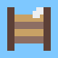 | **Winch** | A drum that winds rope. Turn it with a crank, gears or a motor touching it. If the load is too heavy it **stalls**: nothing turns and it shows a red ⬇ (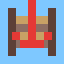). | — |
|  | **Rope** | Put at least one next to the winch and let it hang down. The winch adds rope and takes it away as it lets out and winds in. Rope goes straight: it only turns a corner at a pulley. Water flows through it. | — |
|  | **Pulley** | A wheel the rope runs over, so the rope can change direction: the winch on the ground, the rope up a tower and down the other side. | — |
|  | **Pulley hook** | Hang it on the rope's end and the load under it. Two bits of rope share the load, so it counts **half as heavy**, but it goes up half as fast. | — |
| 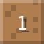 | **Crate** | Weighs **1**. Falls like sand, unless it hangs on a winch's rope. Only the one block on the rope's end is lifted (or a pulley hook and the block under it). | — |
| 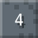 | **Iron weight** | Weighs **4**. Too heavy for a crank turning a winch on its own! | — |

**Slower is stronger.** A crank (strength 2) turning the winch on its own
shaft lifts a crate (weight 1), slowly: pulling half its strength, it goes
half speed. It can't lift the iron weight (4). Put a small gear driving a big
gear in between and the winch turns half as fast but pushes twice as hard, so
the iron weight counts as 2: still too much. Do it twice (a quarter as fast)
and it counts as 1: up it goes. Gear it UP (big gear driving a small one) and
it can't even lift a crate. More strength works too: two cranks, a motor with
more batteries, or lots of water on a water wheel. Real cranes, bike gears and
car gears all trade speed for strength.

**Heavier = slower.** The closer the load is to the machine's strength, the
slower it goes up. Letting it down, the load helps: heavy things come down fast.

**Cut the rope** (⛏️ dig it) and whatever hangs on it falls.

### 🛠️ Machines to build

Each picture was taken from the real game. Build it, then watch.

**Light a lamp.** One battery, some wire, one lamp, all in a loop. Then take
one wire away: the lamp goes dark, because the loop is broken.

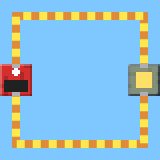

**Sharing electricity.** Two lamps in a row (left) share the push, so both are
dimmer. Two lamps side by side (right) each get their own path, so both shine bright.
Add a third or a fourth beside them: every one still gets its own path.


**Short circuit.** A battery with only wire around it. See the sparks?

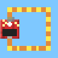

**Music machine.** A battery, a clicker (top) and a note block (bottom) in a
loop. Every time the clicker clicks on, the note sings. Add more note blocks
in other loops on the same clicker for a tune.

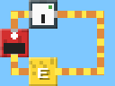

**U-tube.** Build a U out of glass and pour water into one side. Squished
water pushes up the other side until both sides are the same height.

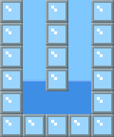

**Water tower.** A tall tank with a pipe from its bottom. The water climbs the
pipe and pours out of the end, because the end is lower than the water in the
tank. (Make the pipe go higher than the water, and nothing comes out.)

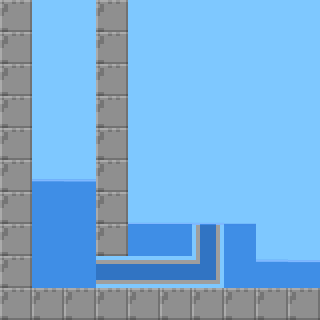

**Steam power plant.** Water in a pot on a **burner**, a **turbine** above it,
and wires from the turbine's sides to a lamp. The burner boils the water, the
steam rushes up through the turbine, and the turbine makes electricity. The
**chiller** turns the steam back into water. That's how real power plants work!

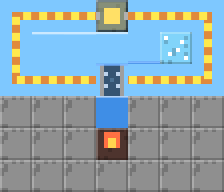

**Pump water uphill.** A pump (arrow pointing up) with water under it and a
battery loop on its sides. The pump pushes the water up, against gravity.

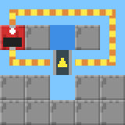

**Gear train.** A crank, then small, big and small gears, an axle, and one more
gear. Each gear turns the other way from the one it touches; the big gear turns
slowly and the small gear after it turns twice as fast. The axle carries the
turning along without flipping it.


**Jam!** Three big gears touching in an L, turned by a crank. They can't turn,
so they all show a red ❌. Take one away and they spin again.

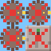

**Hydro dam.** A faucet pours water through a water wheel (and away down a
drain). The wheel turns two gears, the gears turn a generator, and the
generator lights a lamp: water power!

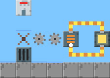

**Crane.** A crank turning a winch, with rope down to a crate. Turn the crank
↻ and the crate goes up; ↺ and it goes down.


**Too heavy!** Swap the crate for an iron weight. The crank can't turn it: the
winch shows a red ⬇ and nothing moves.

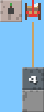

**Gear it down.** Crank, small gear, big gear, axle, small gear, big gear,
winch. The winch turns a quarter as fast, so it's four times as strong, and it
lifts the iron weight (slowly!).


**Pulley hook.** Only one gear step this time, but the iron weight hangs on a
pulley hook, which halves its weight. Up it goes, half as fast.


**Well.** The winch and crank sit on the right; the rope runs up and over a
pulley and hangs down the left side. The pulley changes which way the rope pulls.

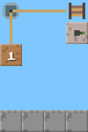

**Sand sinks.** Drop sand onto water. The sand sinks and the water floats up
in its place.

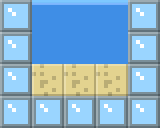

## 🧪 The Chemistry room

Atoms are balls with **hands**: ⚪ H has 1, 🔴 O has 2, 🔵 N has 3, ⚫ C has 4,
🟢 Cl has 1, 🟡 S has 2. Put atoms side by side and they hold hands by
themselves. When **every** hand in a molecule is holding another one, it's
finished: it glows, the room says its name, and it goes in the 📖 book.

| Tool | What it does |
|---|---|
| 🧱 PLACE | Tap or drag to put the chosen atom down |
| ⛏️ REMOVE | Tap or drag to take atoms away |
| 🔗 BOND | Tap between two atoms, or slide from one atom onto the one beside it: one more stick (double, triple bonds). When they can't take more sticks, it pulls them apart, and the next time joins them again. While your finger is down the two atoms glow with what will happen (🔗 one more stick, ✂️ pull apart, 🚫 can't change); it happens when you lift your finger, so slide off to change your mind |

- **Name cards:** 📖 a molecule from the book (with a fun fact), 🌟 a real
  molecule with its real chemistry name ("super rare!"), 💡 a molecule nobody
  has named: your invention. ⏳ means "no internet yet, I'll look it up later".
- **Unlocking:** start with H and O. 💧 Water unlocks ⚫ C. Three carbon
  molecules unlock 🔵 N. Two nitrogen molecules unlock 🟢 Cl and 🟡 S.
- **Crowding:** H atoms take up a cell, so some shapes don't fit. A hand with
  no room left turns red and squished, with a 💥. Move something!
- **Rings:** a ring of 6 carbons (benzene) is a 2×3 rectangle. The two middle
  carbons grab hands across the ring, so pull them apart with 🔗.
- **Grown-ups (⚙️):** unlock every atom, name the newest invention, or erase the book.

The big name list comes from [PubChem](https://pubchem.ncbi.nlm.nih.gov)
(public domain, from the US National Library of Medicine): every molecule
with up to 8 non-H atoms that fits on the board. See `tools/chem-db/README.md`
to remake it.

## 🧪 Experiments to try

Search the code for `🧪 Try this!` to find them all. Some favorites:

1. **Night sky:** in `css/blocks.css`, change `--sky` to `#1a1a40`.
2. **Old-time tuning:** in `js/music-theory.js`, change `A4_HZ` from 440 to 415.
3. **Long notes:** in `js/sound.js`, set `NOTE_SECONDS` to 3.
4. **Hear the click:** set `ATTACK_SECONDS` to 0, then tap a block.
5. **A new chord:** add `sus4: [0, 5, 7],` to `CHORDS`, then copy a chord button in `music.html` and change it to `data-chord="sus4"`.
6. **A new scale:** add `blues: [3, 2, 1, 1, 3, 2],` to `SCALES`, plus a button.
7. **Wild rainbow:** in `js/draw.js`, set `RAINBOW_STEP` to 30.
8. **Hot pink:** add `'#ff69b4'` to `COLORS`.
9. **Four fading copies:** in `js/trace.js`, set `FADE_OPACITIES` to `[0.6, 0.4, 0.2, 0.1]`.
10. **New favorite thing:** add an `<li>` to the list in `index.html`.
11. **Redraw the app icon:** change letters in `img/icon-pixels.txt` (try a different letter instead of the C), then run `node tools/make-icons.js`.
12. **Slow-motion sand:** in `js/build.js`, set `TICKS_PER_SECOND` to 2.
13. **Dimmer lamps:** in `js/blocks/electric.js`, change the lamp's `resistance` to 2.
14. **Slow-motion water:** in `js/fluids.js`, set `FLUID_STEPS` to 1.
15. **Super gears:** in `js/blocks/gears.js`, give the big gear 24 teeth: small gears it drives spin 3 times as fast.
16. **Easy carbon:** in `js/chem/book.js`, change the N step's goal from 3 carbon molecules to 1.
17. **Your own molecule:** add one to `js/chem/kid-names.js` with its SMILES, a name and a fact, then run `npm test`.

## Using it like an app (offline)

On the iPad, open the site in Safari, tap **Share**, then **Add to Home Screen**.
It gets the grass-block icon, opens full-screen with no browser bars, and
works **without internet** once it has been opened online. Fonts are saved
too, on the first visit.

The little badge in the bottom-left corner says how it's going:
**⏳ Saving for offline… (N left)** while files download, **✓ Ready offline**
when everything is saved (check for this before a car trip!), **✓ Playing
offline** with no internet, and **⚠ …** with the reason if offline can't work.

When you change the code and push it, the app picks up the new version the
next time it's opened online. The offline helper (`sw.js`) always tries the
internet first, so you never get stuck with an old copy. If you add a
**new file** to the site, also add it to `PRECACHE` in `sw.js` and change
`caleb-v1` to `caleb-v2`.
If you change a Google Fonts `<link>` in a page, change `FONT_STYLESHEETS`
in `sw.js` to match (the tests check they agree).

In app mode, 💾 save opens the iPad's share/preview sheet instead of
downloading. Choose **Save Image** there.

`manifest.webmanifest` is JSON, which can't hold comments, so here's what it says:
`name` and `short_name` are the app's full name and the name under the icon;
`start_url` is the page it opens on; `display: standalone` means full-screen
with no browser bars; `theme_color` and `background_color` are the sky blue
shown while it starts; `icons` lists the icon pictures (the "maskable" one has
extra sky around it, so phones can cut it into a circle).

## Remaking the pictures

- **Icons:** `node tools/make-icons.js` (built into Node, nothing to install).
  The tests check that `img/icon.svg` matches `icon-pixels.txt`, so they'll
  remind you if you forget.
- **Share card:** this one needs a real browser, so it uses Playwright:
  ```bash
  npm install --no-save playwright
  npx playwright install chromium
  node tools/make-share-card.cjs
  ```
- **Build page block and machine pictures** (`docs/blocks/`, `docs/machines/`):
  same Playwright setup, then `node tools/make-block-pictures.cjs`. Run it
  after changing how a block looks, or after adding a block (a test checks
  that every palette block has a picture in this README).

## Checklist for a real tablet or phone

Run through this after big changes (Caleb is the best tester):

- [ ] Every homepage block opens its page, and 🏠 comes back.
- [ ] Music: the first tap makes sound. On iPhone/iPad, also check the silent switch is off: it mutes web audio.
- [ ] Music: holding a computer key plays one note, not a stream.
- [ ] Music: chords light all their blocks; scales glow and dim; Guess it! counts a right note even after changing octave.
- [ ] Draw: drawing doesn't scroll the page; two fingers draw two separate lines.
- [ ] Draw: a quick tap on 🗑 does nothing; holding it for 1 second clears.
- [ ] Draw: 💾 downloads a PNG.
- [ ] Trace: the cursive guide is joined-up cursive (not a plain font).
- [ ] Trace: weird text in "your word" (emoji, numbers) is cleaned up.
- [ ] Rotating the tablet keeps the drawing and redraws the guides.
- [ ] Nothing scrolls sideways on a phone.
- [ ] Add to Home Screen shows the grass-block icon and opens full-screen.
- [ ] Chemistry: H–O–H says "Water!" and unlocks C; the book shows the water picture.
- [ ] Chemistry: 🔗 on O–O makes O=O (Oxygen); 🔗 on a full pair pulls it apart.
- [ ] Chemistry: holding 🔗 on an atom glows the pair it means (🔗/✂️/🚫); sliding onto another neighbor switches pairs; nothing changes until the finger lifts.
- [ ] Chemistry: a molecule with a long chemistry name gets 🌟 (needs the internet once).
- [ ] Turn on Airplane Mode and open the home-screen app: every page still works.

## Publishing

The site is hosted by GitHub Pages from the `main` branch of
`Team-Hamsa/calebhamsa.fun`. Pushing to `main` updates the live site in
about a minute. There's no build step: GitHub serves these exact files.
