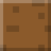
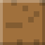

| | Block | What it does |
|---|---|---|
|  | **Grass** | A plain building block, dirt with grass on top. |
|  | **Dirt** | A plain building block. |
|  | **Stone** | A plain building block. Holds water, so it's good for tanks. |
|  | **Wood** | A plain building block. Electricity can't go through it. |
|  | **Glass** | See-through. Build a glass tank to watch the water inside. |
|  | **Obsidian** | A plain dark building block. |
|  | **Gold** | A building block that **carries electricity**, like real gold. It can be used as wire. |
|  | **Sand** | **Falls** until it lands on something. It sinks through water (the water floats up and swaps places). |

**Note blocks:**
      

Each one sings its note when you tap it with ✋ USE. They're the same colors as
the Note Blocks page. Put one in an electric loop and it sings by itself when
the electricity starts flowing.
