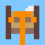
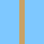

A **winch** winds rope in to lift things, and turning it takes **effort**.
Heavy things need more. Turning ↻ winds the rope in (up), ↺ lets it out (down).

| | Block | What it does | ✋ USE |
|---|---|---|---|
|  | **Winch** | A drum that winds rope. Turn it with a crank, gears or a motor touching it. It has a little **catch** (a ratchet, the pale bit on top): let go and the load stays up. If the load is too heavy it **stalls**: nothing turns and it shows a red ⬇ (). When the load reaches **the top** it can't wind any more: everything stops and it shows an orange ⬆ (). | — |
|  | **Rope** | Put at least one next to the winch and let it hang down. The winch adds rope and takes it away as it lets out and winds in. Rope goes straight: it only turns a corner at a pulley. Water flows through it. | — |
|  | **Pulley** | A wheel the rope runs over, so the rope can change direction: the winch on the ground, the rope up a tower and down the other side. | — |
|  | **Pulley hook** | Hang it on the rope's end and the load under it. Two bits of rope share the load, so it counts **half as heavy**, but it goes up half as fast. Water flows through it, like rope. | — |
|  | **Crate** | Weighs **1**. Falls like sand, unless it hangs on a winch's rope. It **floats** on water. Only the one block on the rope's end is lifted (or a pulley hook and the block under it). | — |
|  | **Iron weight** | Weighs **4**. Too heavy for a crank turning a winch on its own! | — |

**Slower is stronger.** A crank (strength 2) turning the winch on its own
shaft lifts a crate (weight 1), slowly: pulling half its strength, it goes
half speed. It can't lift the iron weight (4). Put a small gear driving a big
gear in between and the winch turns half as fast but pushes twice as hard, so
the iron weight counts as 2: still too much. Do it twice (a quarter as fast)
and it counts as 1: up it goes. Gear it UP (big gear driving a small one) and
it can't even lift a crate. More strength works too: two cranks, a motor with
more batteries, or more water (or a longer fall) onto a water wheel. (One
battery's motor is as strong as one crank. The heavier its load, the more
electricity it takes, and a **stalled** motor takes the most of all and only
gets hot: see [⚙️ Gears](Gears).) Real cranes, bike gears and
car gears all trade speed for strength.

**Heavier = slower.** The closer the load is to the machine's strength, the
slower it goes up. Letting it down, the load helps: heavy things come down fast.
But never faster than they would fall if you just dropped them (one block a
tick): rope can only pull, never push, so a load on a rope can't beat a load
with no rope.
But only while it's really going down. A weight lying on the ground pulls on
nothing (its rope is slack), so it can't turn a winch, it's no free power for a
generator, and it's no use as a counterweight. A counterweight has to **hang**.
Rope that has been let out stays let out: lots of short turns add up, the same
as one long one. So a weight gives its push only by really coming down, and
when it lands, the push is over.

**The catch (ratchet).** Real winches have a little metal finger that clicks
over the teeth of a wheel, so the drum can't spin backwards when you let go.
Ours does too. A hanging load can **never** pull the winch round by itself:
take the crank away (or stop it) and the load just hangs there. Two cranks
pushing opposite ways just as hard cancel out, so nothing is left to lift
with: the winch stalls (red ⬇) and the load stays put. The load only comes
down when something really turns the winch ↺, and then it helps. ("Really"
means a push you could see turn the gears with nothing on the rope, and at
least a tenth as strong as the load's pull. A tiny trickle of electricity
straying into a motor from a wire next door doesn't count: the catch stays
on. At most the load creeps down as slowly as that trickle turns the gears,
and it gives no push of its own.) That means
a falling weight can't run a generator by itself here, and a heavy weight
won't haul up a lighter one without a crank to start it. (A real winch with
its catch lifted off would do both.)

**The top is a hard stop.** When the load has been wound right up to the
winch (or to the pulley its rope hangs from), the rope can't wind in any more.
On a real crane that is a dead stop, and it is here too: the winch shows an
orange ⬆ and **everything** on its gears stops. A hand crank stops dead, a
motor stalls, and any other gears, generators and winches on the same train
stop with it. Nothing is broken and nothing is too heavy (that's the red ⬇):
it has just got to the top. Only winding **in** is stopped. Turn the winch the
other way (↺) and the load comes straight down again; take the crank away and
the catch holds it up there. A rope with **nothing** hanging on it doesn't
stop anything: bare rope just winds onto the drum and the winch keeps turning.

**One rope end, one winch.** If two winches' ropes meet at a pulley and share
the same hanging end, the winch that is being **turned** winds it and feels its
weight: crank either one and the load comes up. The other just holds still. If
both are turned at once, only the first (the higher one, or the one further
left) carries the load, and the other spins with nothing on it. The load goes
at the speed of the rope, never twice as fast. When the load gets to the
pulley, neither rope can be pulled any further, so **both** winches stop (orange ⬆).

**Water pushes back.** A load going down into water has to lift that water up
out of its way, and that takes push. So in water a load feels **lighter**, by
the weight of the water it moves: a block full of water weighs as much as 2½
crates. An iron weight (4) still sinks, but it pulls on its rope with only 1½.
A crate **floats**: let down onto deep water it stops on top, its rope goes
slack, and it helps the winch no more (just like a load on the ground). It
still sinks into a shallow puddle, less than half a block deep. A **pulley
hook** changes none of this: water runs through the hook, like rope, so only
the load under it has to push water out of the way. Iron on a hook sinks just
like iron alone, and an empty hook goes down into a well with no trouble.

**Loose blocks follow the same rule.** A crate that is just falling (its rope
dug away) floats on water too. **Sand** is heavy (it weighs 4, like an iron
weight), so sand and iron sink.

**Steam pushes back the other way.** Steam wants to be high, so a load going
**up** through steam has to push the steam **down**, and that makes it heavier
to lift (by 2½ crates for a block full of steam). Too much steam in the way and
the crank stalls.

Why? Because lifted water can fall again and turn a water wheel, and steam
that has been pushed down rises again and can turn a turbine. If moving them
cost nothing, a hand flipping a crank to and fro could light a lamp for ever
without doing any work. The load pays for the water or steam with every bit of
rope, and it only moves once it has paid.

Three places where the game is still simpler than the real world: going the
*easy* way gives nothing back (water over a load doesn't help lift it, so a
crate under water does not bob up by itself); a block is always in one whole
square, so a floating crate sits in the square **above** the water, even over
a puddle half a block deep; and water deep down in a tall tank is squeezed, so
it weighs a bit more than water at the top (sand and iron stop sinking about
6 blocks down a full tank).

**Ropes that cross are tied.** If one winch's rope runs on *through* the end of
another winch's rope, that end is tied into it and can't be wound in (its winch
just turns, or stops with an orange ⬆ if it has a load). Otherwise one winch
could cut another's rope, drop its load into a pool for nothing, and a machine
could do that over and over. Only ⛏️ digging cuts a rope.

**Rope let out is owed.** A load can pull a little rope out before it has come
down a whole block. Winding that little bit back always costs at least as much
as the load gave for it, even if you dig the load away in between.

**Cut the rope** (⛏️ dig it) and whatever hangs on it falls.
