Each picture was taken from the real game. Build it, then watch.

**Light a lamp.** One battery, some wire, one lamp, all in a loop. Then take
one wire away: the lamp goes dark, because the loop is broken.

**Sharing electricity.** Two lamps in a row (left) share the push, so both are
dimmer. Two lamps side by side (right) each get their own path, so both shine bright.
Add a third or a fourth beside them: every one still gets its own path.

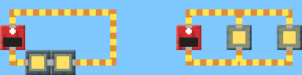

**Short circuit.** A battery with only wire around it. See the sparks?

**Music machine.** A battery, a clicker (top) and a note block (bottom) in a
loop. Every time the clicker clicks on, the note sings. Add more note blocks
in other loops on the same clicker for a tune.
Note blocks need enough electricity to sing: one battery can make 4 in a row
sing, but with 5 in one loop each gets too little and they all stay quiet
(the dots still crawl along). Add a battery, or give each note its own path.

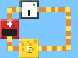

**U-tube.** Build a U out of glass and pour water into one side. Deep water
presses harder, so it pushes up the other side until both sides are the same
height.

**Water tower.** A tall tank with a pipe from its bottom. The water climbs the
pipe and pours out of the end, because the end is lower than the water in the
tank. (Make the pipe go higher than the water, and nothing comes out.) Try a
taller tower, and put a water wheel with a block on top of it at the end of the
pipe.

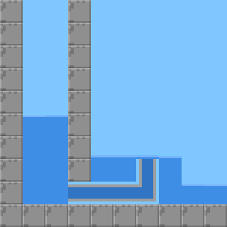

**Steam power plant.** Water in a pot on a **burner**, a **turbine** above it,
a **generator** right beside the turbine, and wires from the top and bottom of
the generator to a lamp. The burner boils the water, the steam rushes up and
spins the turbine, the turbine turns the generator, and the generator makes
electricity. The **chillers** turn the steam back into water, which runs back
down into the pot. That's how real power plants work! Try more lamps: the
turbine slows down. (A turbine makes turning, not electricity. A plant with
wires straight on the turbine's sides stays dark: it needs a generator.)

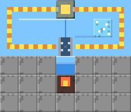

**Pump water uphill.** A pump (arrow pointing up) with water under it and a
battery loop on its sides. The pump pushes the water up, against gravity.
Try a taller shaft: one battery gets the water about 5 blocks up, slower and
slower, and then it stops. Add a battery and it climbs higher. So does a
second pump stood right on top of the first (wire it up too).

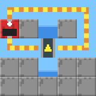

**Gear train.** A crank, then small, big and small gears, an axle, and one more
gear. Each gear turns the other way from the one it touches; the big gear turns
slowly and the small gear after it turns twice as fast. The axle carries the
turning along without flipping it.

**Jam!** Three big gears touching in an L, turned by a crank. They can't turn,
so they all show a red ❌. Take one away and they spin again.

**Hydro dam.** A faucet pours water through a water wheel (and away down a
drain). The wheel turns two gears, the gears turn a generator, and the
generator lights a lamp: water power! The wheel sits where the water **falls**:
that's where water gives its push. (Real dams are tall for the same reason:
the further the water falls, the more work it can do.)

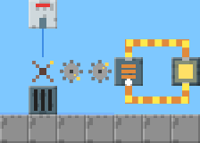

**Crane.** A crank turning a winch, with rope down to a crate. Turn the crank
↻ and the crate goes up; ↺ and it goes down.

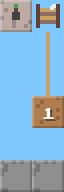

**At the top.** Keep turning ↻ and the crate reaches the winch. The rope can't
wind any more, so the crank stops dead and the winch shows an orange ⬆. Turn
the crank ↺ to let it down again.

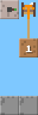

**Too heavy!** Swap the crate for an iron weight. The crank can't turn it: the
winch shows a red ⬇ and nothing moves.

**Gear it down.** Crank, small gear, big gear, axle, small gear, big gear,
winch. The winch turns a quarter as fast, so it's four times as strong, and it
lifts the iron weight (slowly!).

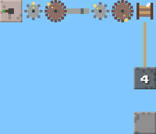

**Pulley hook.** Only one gear step this time, but the iron weight hangs on a
pulley hook, which halves its weight. Up it goes, half as fast.

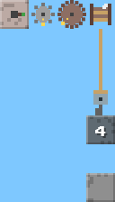

**Well.** The winch and crank sit on the right; the rope runs up and over a
pulley and hangs down the left side. The pulley changes which way the rope pulls.

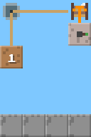

**Sand sinks.** Drop sand onto water. The sand sinks and the water floats up
in its place.

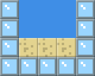
